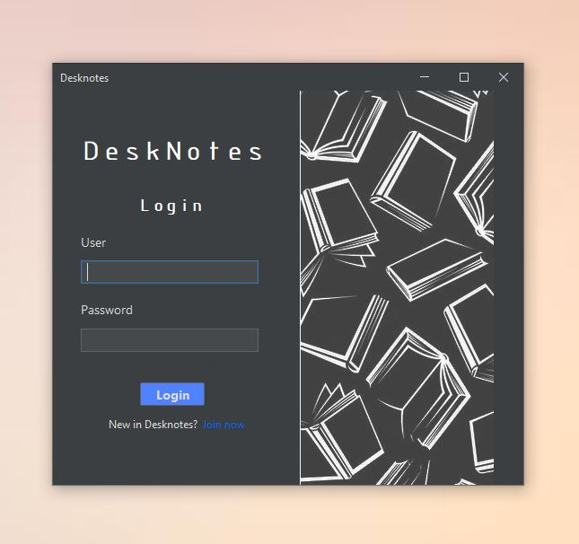
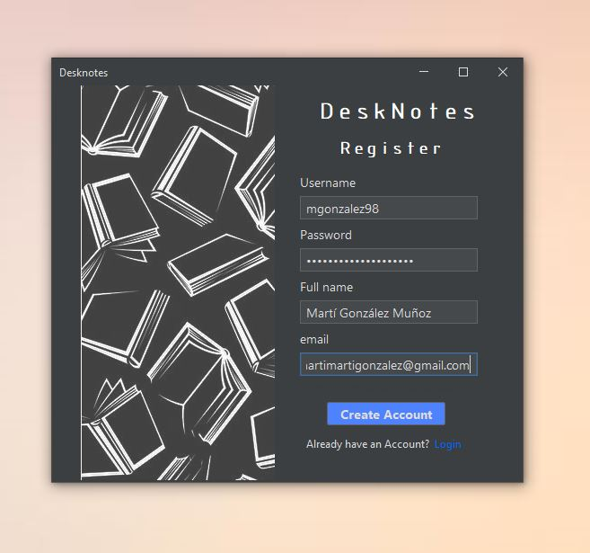
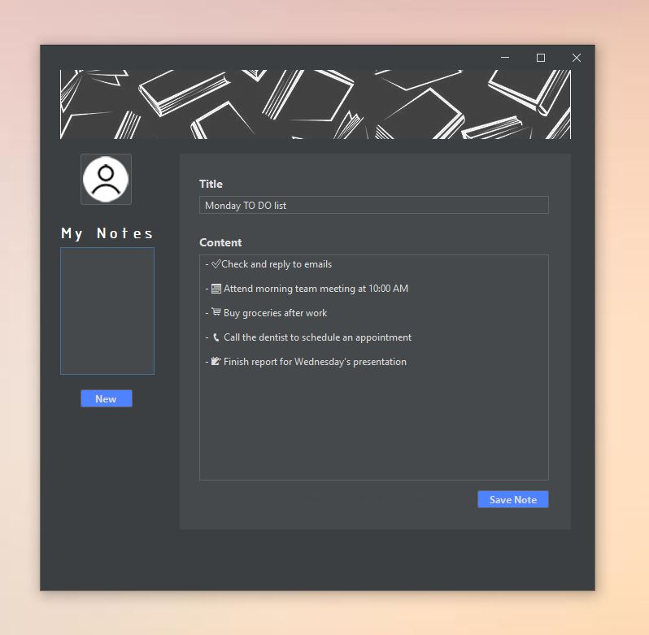
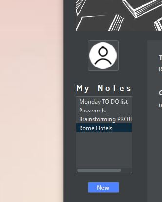
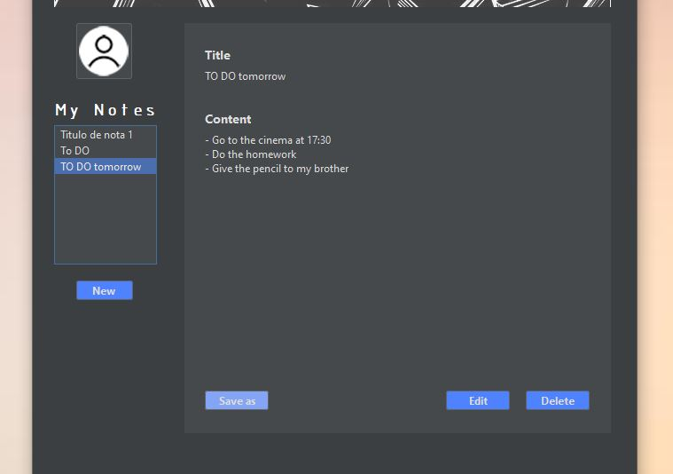

# 📑 Desknotes
Desknotes es un programa para generar y editar tus notas. Podrás crear tu usuario, o entrar con él si ya lo tienes, y crear todas las notas que desees. Tanto tu usuario como tus notas serán almacenadas en una Base de Datos.
> [!NOTE]
> **Estado** — En producción🔧

## 🚀 Tecnologías utilizadas
- **Java**
- Packages / Librerías:
  - **flatlaf-3.5.2** — tema aplicado a Swing
  - **mysql-connector-j-9.2.0.jar** — para la conexión con la base de datos MySQL
- **MySQL** — gestionada con XAMPP

## 📋 Prerequisitos
### 🧰 Herramientas necesarias
- **XAMPP** — Para levantar el servidor MySQL local
- **NetBeans** u otro IDE Java — Para ejecutar el proyecto

### 📦 Librerías
En la raíz del proyecto encontrarás la carpeta lib/. Aquí se encuentran las librerías .jar necesárias.\
Necesitarás agregar:
- **flatlaf-3.5.2**
- **mysql-connector-j-9.2.0.jar**
> [!NOTE]
> Asegúrate de agregarlas al **Classpath** de tu proyecto

### ⚙ Configuración
En la carpeta **src** del proyecto encontrarás el archivo **config.properties**. Ábrelo y configuralo:
```bash
host=localhost
port=3306
user=root
password=
database=desknotes

# estos valores son los típicos por defecto pero:
# - asegúrate de que el puerto por el que escucha mysql es el 3306 (lo és por defecto)
# - que tu usuario y contraseña sean los correctos
# - la base de datos puede llevar el nombre que desees
```

## 🏃‍♂️ Ejecución
1. Abre XAMPP
2. Inicia los servicios de Apache y MySQL
3. Una vez estén activos, puedes ejecutar el proyecto desde tu IDE (NetBeans, Eclipse, etc.)\
✅ Asegúrate de que los parámetros de conexión (config.properties) estén bien configurados

## 🎨 Funcionalidades
- Podrás acceder a la aplicación con tu usuario, o de no ser así, registrarte desde el botón pertinente.
<div style="display: flex; gap: 20px;">
  
  
</div>

- Al entrar, podrás crear tus notas, editarlas o eliminarlas.
Todas las notas creadas las podrás visualizar en tu lista personal, a la izquierda de la ventana.
<div style="display: flex; gap: 20px;">
  
  
  
</div>
